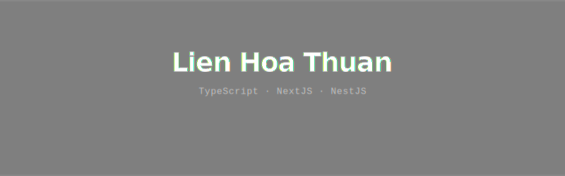

<!-- ═══ BANNER: GIF bg + Name + Role + Badges ════════════════ -->
<!-- ⚠️  Commit banner.svg vào .github/assets/ trong repo       -->

 
<!-- Badges ẩn phía dưới để vẫn có thể click được -->
<a href="https://www.linkedin.com/in/lianharman/" title="LinkedIn" style="display:none">.</a>
<a href="https://discord.com/users/983724520789655613" title="Discord" style="display:none">.</a>
<a href="https://www.youtube.com/@LienThuan04" title="YouTube" style="display:none">.</a>
<a href="https://www.facebook.com/LianHarman/" title="Facebook" style="display:none">.</a>
<a href="https://gitlab.com/LienThuan04" title="GitLab" style="display:none">.</a>
<a href="mailto:lienthuan2004@gmail.com" title="Gmail" style="display:none">.</a>
  

<!-- ═══ DIVIDER ════════════════════════════════════════════════ -->
<picture>
  <source media="(prefers-color-scheme: dark)"  srcset="https://capsule-render.vercel.app/api?type=rect&height=1&color=333333" />
  <source media="(prefers-color-scheme: light)" srcset="https://capsule-render.vercel.app/api?type=rect&height=1&color=ebebeb" />
  
</picture>

 

## Now Playing

<table align="center">
  <tr>
    <td align="center" valign="top" width="50%">
      <h3>Spotify Now Playing</h3>
      
    </td>
    <td align="center" valign="top" width="50%">
      <h3>Discord Status</h3>
      
    </td>
  </tr>
</table>
  

  

<!-- ═══ DIVIDER ════════════════════════════════════════════════ -->
<picture>
  <source media="(prefers-color-scheme: dark)"  srcset="https://capsule-render.vercel.app/api?type=rect&height=1&color=333333" />
  <source media="(prefers-color-scheme: light)" srcset="https://capsule-render.vercel.app/api?type=rect&height=1&color=ebebeb" />
  
</picture>

 

## Activity

<picture>
  <source media="(prefers-color-scheme: dark)"
    srcset="https://github-readme-stats.vercel.app/api?username=LienThuan04&hide_title=false&hide_rank=true&show_icons=true&include_all_commits=true&count_private=true&disable_animations=false&theme=github_dark&locale=en&hide_border=false&order=1" />
  <source media="(prefers-color-scheme: light)"
    srcset="https://github-readme-stats.vercel.app/api?username=LienThuan04&hide_title=false&hide_rank=true&show_icons=true&include_all_commits=true&count_private=true&disable_animations=false&theme=default&locale=en&hide_border=false&order=1" />
  
</picture>
<picture>
  <source media="(prefers-color-scheme: dark)"
    srcset="https://github-readme-stats.vercel.app/api/top-langs?username=LienThuan04&locale=en&hide_title=false&layout=compact&card_width=320&langs_count=10&theme=github_dark&hide_border=false&order=2" />
  <source media="(prefers-color-scheme: light)"
    srcset="https://github-readme-stats.vercel.app/api/top-langs?username=LienThuan04&locale=en&hide_title=false&layout=compact&card_width=320&langs_count=10&theme=default&hide_border=false&order=2" />
  
</picture>

 

<picture>
  <source media="(prefers-color-scheme: dark)"
    srcset="https://github-readme-activity-graph.vercel.app/graph?username=LienThuan04&radius=4&theme=react-dark&area=true&hide_border=true&bg_color=0d1117&color=ffffff&line=5ba4f5&point=5ba4f5&area_color=1a2a3a" />
  <source media="(prefers-color-scheme: light)"
    srcset="https://github-readme-activity-graph.vercel.app/graph?username=LienThuan04&radius=4&theme=minimal&area=true&hide_border=true&bg_color=ffffff&color=171717&line=171717&point=0072f5&area_color=ebf5ff" />
  
</picture>

 

<!-- ═══ DIVIDER ════════════════════════════════════════════════ -->
<picture>
  <source media="(prefers-color-scheme: dark)"  srcset="https://capsule-render.vercel.app/api?type=rect&height=1&color=333333" />
  <source media="(prefers-color-scheme: light)" srcset="https://capsule-render.vercel.app/api?type=rect&height=1&color=ebebeb" />
  
</picture>

 

## Contributions

<picture>
  <source media="(prefers-color-scheme: dark)"  srcset="https://raw.githubusercontent.com/LienThuan04/LienThuan04/output/pacman-contribution-graph-dark.svg" />
  <source media="(prefers-color-scheme: light)" srcset="https://raw.githubusercontent.com/LienThuan04/LienThuan04/output/pacman-contribution-graph.svg" />
  
</picture>

 

<!-- ═══ BOTTOM DIVIDER ════════════════════════════════════════ -->
<picture>
  <source media="(prefers-color-scheme: dark)"  srcset="https://capsule-render.vercel.app/api?type=rect&height=1&color=333333" />
  <source media="(prefers-color-scheme: light)" srcset="https://capsule-render.vercel.app/api?type=rect&height=1&color=ebebeb" />
  
</picture>

 

  
   
  <code>profile views</code>

 

